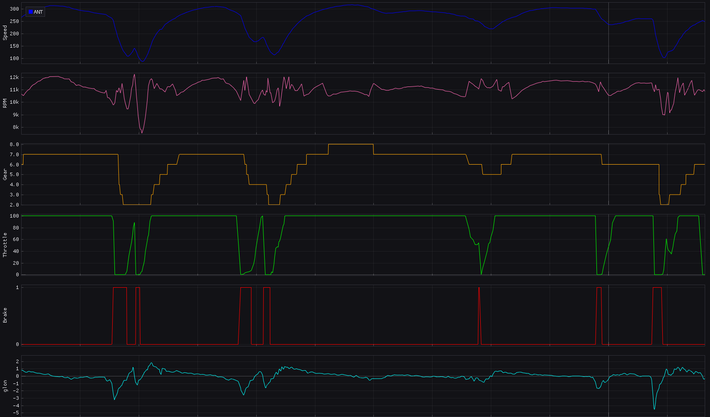
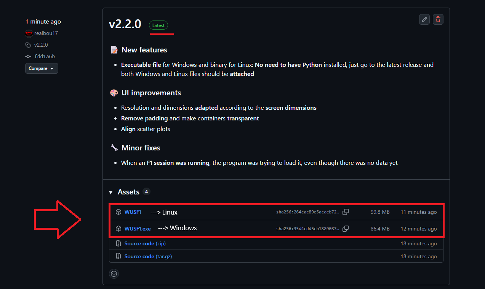
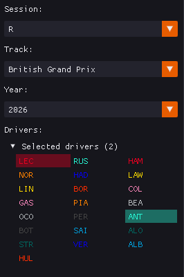

# WUSF1
A new way to exploit F1 data, thanks to [Fastf1](https://docs.fastf1.dev/index.html) and Python. 🏎️



# 📋Features
- **GUI Menu**: Allows user to easly choose the session to load, and to navigate through the menus
- **Multiple representations**
  - 📈 **Graphs**: A traditional and clean way to exploit available data
    - Speed, RPM, Gear, Throttle, Brake (on-off), Glon, DRS (on-off), Delta
  - 📊 **Histograms**: A more direct and concise alternative representation (Speed, RPM, Gear and Throttle only)
  - 🔵 **Scatter**: A visual correlation tool that plots two channels against each other to reveal relationships — ideal for variables like RPM vs Speed (for gear ratios and optimization) or Glon vs Speed (to spot car balance at different speeds)
  - 🔢 **Statistics**: A table showing vital statistics (minimum, maximum, mean, median and standard deviation) of all available channels
  - 🛰️ **Track**: The outline of the track loaded, with a dot representing the position of the car according to mouse position in the graphs
- **All sessions available**: Analyze telemetry from every session since 2018, including FPs, qualy, races and even winter tests
- **Comparison**: Compare telemetry between multiple drivers using delta graph
- **Customization**:
    - Choose between driver's team color or a traditional color palette for telemetry channels
    - Hide or show delta graph by pressing D on your keyboard	
    - Hide lap time selector fileds for a clearer visualization

# ⚙️ Installation and Requirements
**Windows and Linux compatible**: Go to the latest release post and you should find both .exe and binary file ready to use, no additional requirements, without needing to have Python installed:



**For Python users who want to go further:**
```bash
pip install -r requirements.txt
```
- Python 3.10+
- [Fastf1](https://docs.fastf1.dev/index.html)
- Numpy
- Dearpygui
...

# 💻 Usage
1. In the upper left of the GUI menu **fill** following inputs, following examples:

    _*Note: Latest session will be loaded by default_

    

    - **Session**: R -> Race, Q -> Qualy , FPx -> Practice x (Testing sessions considered as practice sessions)
    - **Track**: Select the name of the track/country by unfolding the dropdown menu
    - **Year**: Choose from 2018 to the present by unfolding the dropdown menu
    - **Driver**: Select driver(s) to analyze

      _*Note: For more info check [Fastf1 documentation](https://docs.fastf1.dev/events.html)._
2. Click **'Show Telemetry'** to display data
    - Select the lap scrolling trough the horizontal menu at the top, fastest lap will be displayed in purple and loaded first by default
3. **Zoom** in by **dragging** the right mouse click and **reset** the zoom with a **double** left click  
4. Choose representation by switching **tabs** in the top left
5. Happy Telemetry!


# 🤝License and contributing
This project is under [MIT license](https://tlo.mit.edu/understand-ip/exploring-mit-open-source-license-comprehensive-guide). Feel free to contribute to this project fixing bugs, adding [roadmap's](https://github.com/realbou17/WUSF1/blob/main/roadmap.md) features or even more...
